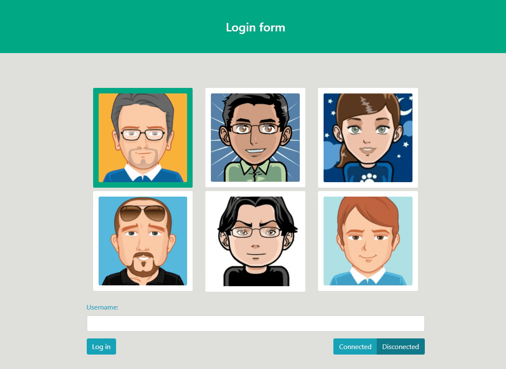
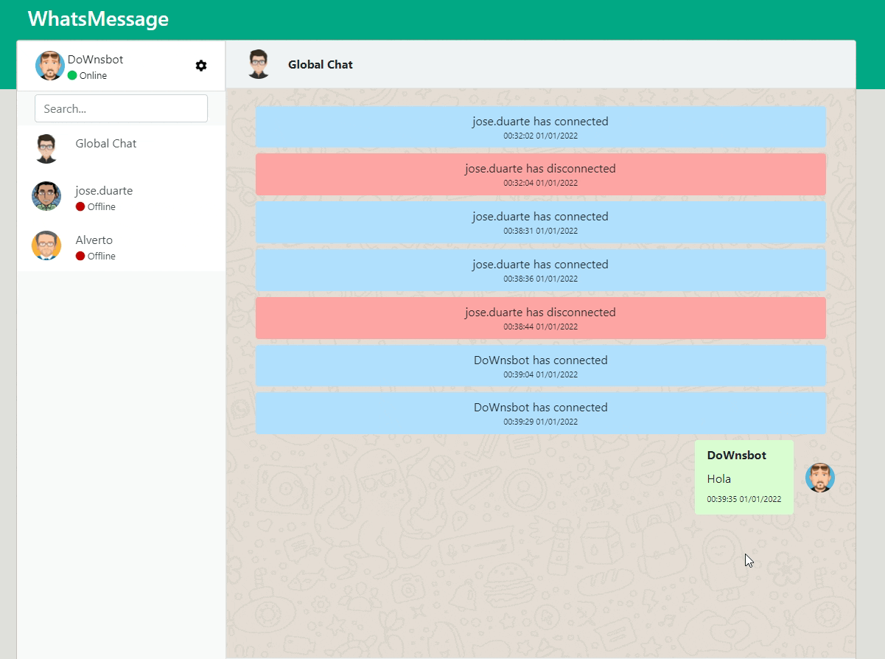
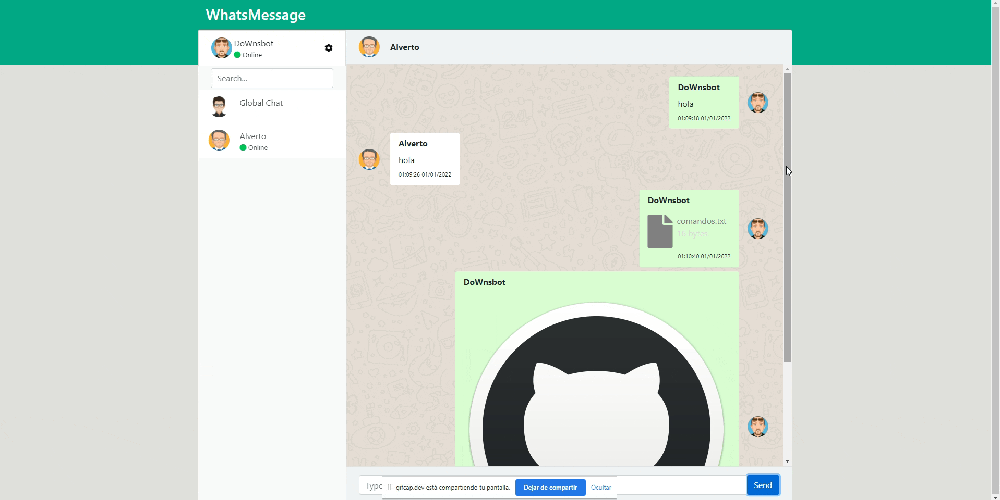

# WhatsMessageApp-React
**Project name:** WhatsMessageApp-React 
**Author:** [DainWs](https://github.com/DainWs) 
**Production:** [Heroku](https://calm-caverns-07225.herokuapp.com/) 

## Caracteristics
Login with an selected **image**, **name** and **state** (*connected* or *disconnected*):

    

You can type messages with all guys in the global chat:

    

Too you can chatting with your friends in private chats and upload files!!!!

    

## Avaibles commands
These are the commands you can use for this Node Multi Project:
 - `npm run start` will build the client side version, and then the server will start.
 - `npm run start-client` will run the client side with react.
 - `npm run start-server` will run the server side with nodemon.
 - `npm run build` will build the client side version.

If you are located in the client module, you can execute the following commands:
 - `npm run start` will run the client side with react.
 - `npm run build` will build the client side with react.
 - `npm run watch` will watch for client side changes and re-build each time.

## Requeriments
Se pide la creación de un clon de la plataforma web de WhatsApp basado en NodeJS. Aunque la funcionalidad no será exactamente la misma, se debe intentar copiar la interfaz con el mayor detalle. Antes de poder acceder a la web, el usuario debe identificarse mediante un nombre, un estado y una imagen, que puede escogerse de una lista predefinida de avatares. Sólo se debe poder acceder estando identificado.

Una vez hecho, en el panel izquierdo se mostrará la lista de usuarios conectados en ese momento. En el central, tendremos acceso a una sala común de chat en la que se encontrarán todos los usuarios. El servidor deberá informar a los usuarios cada vez que alguien entra o sale del chat. Del mismo modo, debe reflejarse también cuando alguien está escribiendo.

El código de la aplicación debe subirse a GitHub, indicando claramente en el README principal la URL de la versión en producción (Heroku por ejemplo).

- [X] Identificarse con una foto, nombre y un estado.
- [X] Solo se puede acceder estando autentificado.
- [X] En el panel izquierdo se mostrara la lista de los usuarios conectados.
- [X] En el central, tendremos acceso a una sala común de chat en la que se encontrarán todos los usuarios.
- [X] El servidor deberá informar a los usuarios cada vez que alguien entra o sale del chat.
- [X] El servidor deberá informar a los usuarios cada vez cuando alguien está escribiendo.
- [X] Codigo subido a Github
- [X] Puesta en producción bien clara en el Readme.

Esos son los requisitos mínimos (5 puntos). Para subir la nota, el alumno/a puede implementar las mejoras que quiera de la siguiente lista (tenéis libertad para escoger cuáles:

- [X] (3 puntos) Permitir mantener una conversación privada con un usuario concreto. Se seleccionaría del panel izquierdo el usuario, y en una ventana independiente de la sala principal, se podría mantener una conversación.
- [ ] (3 puntos) Permitir realizar videoconferencias, de modo que igual que en el punto anterior, al seleccionar a un usuario pueda iniciarse una videoconferencia entre ambos (se considera válido si se intercambia sólo el video a la vez que se escribe, o sea, sin sonido).
- [ ] (1,5 puntos) Dividir el chat en salas, de modo que cada usuario pueda entrar en aquellas que desee a chatear.
- [X] (2 puntos) Permitir compartir archivos en la sala de chat. Si los archivos son de tipo imagen, deben mostrarse y permitir descargarlas. En otro caso, debe sólo permitir descargar.
- [X] (1,5 puntos) El desarrollo del cliente se realiza usando alguno de los frameworks estudiados en clase y mediante componentes.

Además de éstas, el alumno/a puede proponer libremente aquellos otros aspectos que desee implementar que sean de su interés, debiendo estos ser validados previamente por el profesor, indicando en ese momento éste además la valoración máxima que tendrá esa mejora.